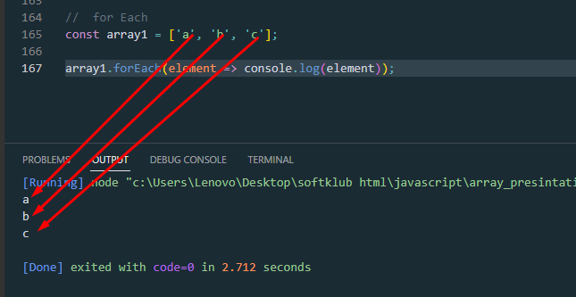

# presintation3_array

> <h1> Array </h1>
> Объект Array, ба монанди массивҳо дар забонҳои дигари барномасозӣ, имкон медиҳад, ки маҷмӯаи объектҳои сершуморро зери як номи як тағирёбанда нигоҳ дорад ва барои иҷрои амалҳои массиви умумӣ аъзо дорад .
 <ol>
 <li> Массивҳои JavaScript тағирёбандаанд ва метавонанд омехтаи намудҳои гуногуни маълумотро дар бар гиранд . (Вақте ки ин хусусиятҳо номатлубанд, ба ҷои массивҳои чопшударо истифода баред .)</li>
 <li> Массивҳои JavaScript массивҳои ассотсиативӣ нестанд ва аз ин рӯ, ба унсурҳои массив бо истифода аз сатрҳои худсарона ҳамчун индекс дастрас шудан мумкин нест, аммо бояд бо истифода аз ададҳои ғайриманфи (ё шакли сатри мувофиқи онҳо) ҳамчун индекс дастрас карда шаванд.</li>
 <li>Массивҳои JavaScript ба сифр индексатсия карда мешаванд : унсури якуми массив дар index 0, дуюмаш дар index 1ва ғайра — ва унсури охирин дар арзиши хосияти массив lengthминус аст 1.</li>
 <li> Амалиёти массиви нусхабардории JavaScript нусхаҳои камёфт эҷод мекунанд .Ҳамаи амалиёти нусхабардории дарунсохт бо ҳама гуна объектҳои JavaScript нусхаҳои камёфтро ба ҷои нусхаҳои амиқ эҷод мекунанд </li>
 </ol>
 
><h1> Array Methods</h1>

<h1>1)Method Pop</h1>

>
The pop() method removes the last element from an array and returns that element. This method changes the length of the array.

> <h1> Methods Push </h1>
The push() method adds the specified elements to the end of an array and returns the new length of the array.

<!--  shift -->
><h1> shift </h1>
The shift() method removes the first element from an array and returns that removed element. This method changes the length of the array.

> <h1>Methods Unshift</h1>
The unshift() method adds the specified elements to the beginning of an array and returns the new length of the array.

> <h1> toString </h1>
The toString() method returns a string representing the specified array and its elements.

> <h1> Splice </h1>
The splice() method changes the contents of an array by removing or replacing existing elements and/or adding new elements in place.

To create a new array with a segment removed and/or replaced without mutating the original array, use toSpliced(). To access part of an array without modifying it, see slice().

splice 3 параметр кабул мекунад. 
1)чандум индекс 
2) чанд элемент удалит шавад 
3)чи элемент монем 

> <h1>Array Slice</h1>
The slice() method returns a shallow copy of a portion of an array into a new array object selected from start to end (end not included) where start and end represent the index of items in that array. The original array will not be modified.

><h1>concat()</h1>
The concat() method is used to merge two or more arrays. This method does not change the existing arrays, but instead returns a new array.

> <h1>join()</h1>
Усул join()бо пайваст кардани ҳамаи элементҳои массив (ё объекти ба массив монанд ) бо вергул ё сатри ҷудокунандаи муайян ҷудошуда сатри навро эҷод ва бармегардонад. Агар массив танҳо як адад дошта бошад, он объект бе истифодаи ҷудокунанда баргардонида мешавад.

> <h1>Sort()</h1>
The sort() method sorts the elements of an array in place and returns the reference to the same array, now sorted. The default sort order is ascending, built upon converting the elements into strings, then comparing their sequences of UTF-16 code units values.

The time and space complexity of the sort cannot be guaranteed as it depends on the implementation.

To sort the elements in an array without mutating the original array, use toSorted().

<!-- indexOf() -->
><h1>indexOf()</h1>
Усул indexOf()индекси аввалро бармегардонад, ки дар он элементи додашуда дар массив пайдо мешавад ё -1 агар он мавҷуд набошад.

><h1>includes()</h1>
The includes() method determines whether an array includes a certain value among its entries, returning true or false as appropriate.

<h1>inho hamaashon colbackFunction meboshad.</h1>
колбекФунксия функсияе мебошад ки  дар даруни финксияи дигар  хамчун параметр меояд

<h1>Map()<h1>
The map() method creates a new array populated with the results of calling a provided function on every element in the calling array.
element 
The current element being processed in the array.

index 
The index of the current element being processed in the array.

array 
The array map() was called upon.

> <h1>filter() </h1>
>Ин filter()усул як нусхаи ками як қисми массиви додашударо эҷод мекунад, ки танҳо ба унсурҳои массиви додашуда филтр карда мешавад, ки аз санҷиши иҷрошудаи функсияи пешниҳодшуда мегузарад.

Усул find()элементи якумро дар массиви додашуда, ки вазифаи санҷиши пешниҳодшударо қонеъ мекунад, бармегардонад. Агар ягон арзишҳо вазифаи санҷиширо қонеъ накунанд, undefinedбаргардонида мешавад.

Агар ба шумо индекси элементи ёфтшуда дар массив лозим бошад, -ро истифода баред findIndex().
Агар шумо бояд индекси арзишро пайдо кунед , -ро истифода баред indexOf(). (Ин ба - монанд аст findIndex(), аммо ба ҷои истифодаи функсияи санҷишӣ ҳар як элементро барои баробарӣ бо арзиш тафтиш мекунад.)
Агар ба шумо лозим ояд, ки оё арзиш дар массив мавҷуд астincludes() , истифода баред . Боз ҳам, он ба ҷои истифодаи функсияи санҷишӣ ҳар як унсурро барои баробарӣ бо арзиш тафтиш мекунад.
Агар ба шумо лозим ояд, ки фаҳмед, ки оё ягон элемент ба вазифаи санҷиши пешниҳодшуда қонеъ аст, истифода баред some().

><h1>Reduce()</h1>
Дарreduce() усул функсияи бозхонди "редуктор"-и аз ҷониби корбар таъминшударо дар ҳар як унсури массив иҷро мекунад, бо тартиби интиқоли арзиши бозгашт аз ҳисоби элементи қаблӣ. Натиҷаи ниҳоии иҷро кардани редуктор дар тамоми унсурҳои массив арзиши ягона аст.

Бори аввал, ки занги бозгашт иҷро мешавад, "қимати баргардонидани ҳисобҳои қаблӣ" вуҷуд надорад. Агар дода шавад, арзиши ибтидоӣ метавонад ба ҷои он истифода шавад. Дар акси ҳол, унсури массив дар индекси 0 ҳамчун арзиши ибтидоӣ истифода мешавад ва такрор аз унсури навбатӣ оғоз мешавад (индекс 1 ба ҷои индекс 0).

Эҳтимол осонтарин ҳолат барои фаҳмидан reduce()ин баргардонидани маблағи ҳамаи элементҳои массив аст:

<!-- forEach() -->
> <h1> forEach()</h1>
Усул forEach()функсияи пешниҳодшударо барои ҳар як элементи массив як маротиба иҷро мекунад.

> <h1> sort()</h1>
Ин sort()усул унсурҳои массивро дар ҷои худ ҷудо мекунад ва истинодро ба ҳамон массив, ки ҳоло мураттаб шудааст, бармегардонад. Тартиби ҷудокунии пешфарз болоравист, ки пас аз табдил додани элементҳо ба сатрҳо ва сипас муқоисаи пайдарпайии онҳо арзишҳои воҳидҳои коди UTF-16 сохта шудааст.

Мушкилии вақт ва фазои навъро кафолат додан мумкин нест, зеро он аз татбиқ вобаста аст.